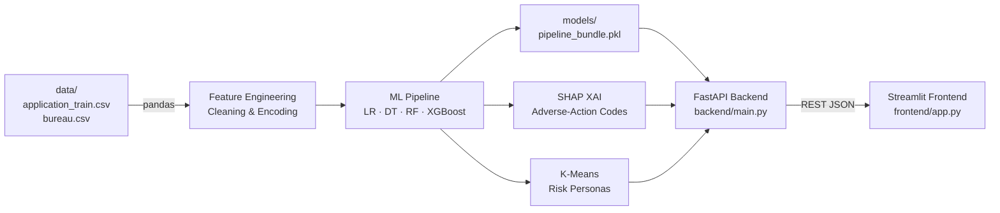

# AI-Powered Credit Risk Assessment for Financial Inclusion with Explainable AI

> **One-line description:** End-to-end ML system that predicts loan default risk, explains decisions in plain English, audits demographic fairness, and serves predictions via a FastAPI backend and Streamlit dashboard.

---

## Problem Statement

Over **1.7 billion adults globally remain unbanked** — denied credit not because they are high-risk, but because traditional scorecards have no data on them ("thin-file" borrowers). This project builds an explainable, fairness-audited credit-risk assessment system on the **Home Credit Default Risk** dataset that:

1. Accurately predicts loan default probability (addressing ~11:1 class imbalance).
2. Explains *why* each prediction was made using SHAP values (XAI).
3. Generates **adverse-action-style reason codes** for high-risk applicants (regulatory-grade).
4. Audits the model for **demographic fairness** (gender, age bands) — SDG 10 alignment.
5. Segments borrowers into interpretable **risk personas** via K-Means clustering.
6. Exposes everything through a **FastAPI REST API** and **Streamlit interactive dashboard**.

**SDG Tags:** 🎯 SDG 1 (No Poverty) | 🎯 SDG 8 (Decent Work) | 🎯 SDG 10 (Reduced Inequalities)

---

## Dataset

| File | Description |
|------|-------------|
| `application_train.csv` | 307,511 loan applications × 122 features; `TARGET` = 1 (default) / 0 (repaid) |
| `bureau.csv` | Prior bureau credit history; joined on `SK_ID_CURR` |
| `HomeCredit_columns_description.csv` | Column definitions used for feature documentation |

**Source:** [Kaggle — Home Credit Default Risk](https://www.kaggle.com/competitions/home-credit-default-risk)  
All files are pre-loaded in `./data/` — **no download required**.

---

## Architecture



### ASCII fallback

```
data/ ──► Feature Engineering ──► ML Models (XGBoost best)
                                        │
                              ┌─────────┴──────────┐
                           SHAP XAI           K-Means Clusters
                              │                     │
                         pipeline_bundle.pkl ◄──────┘
                              │
                     FastAPI (backend/main.py)
                     POST /predict  POST /predict_batch
                     GET /clusters  GET /health  GET /model_info
                              │
                   Streamlit (frontend/app.py)
                   Single Predict │ What-If │ Batch │ Overview
```

---

## Technologies Used

| Layer | Technology |
|-------|-----------|
| Data & ML | pandas, numpy, scikit-learn, XGBoost / LightGBM, imbalanced-learn |
| Explainability | **SHAP** (TreeExplainer, summary & local plots) |
| Clustering | K-Means, PCA (scikit-learn) |
| Hyperparameter tuning | RandomizedSearchCV, Optuna |
| Backend API | **FastAPI**, Uvicorn, Pydantic |
| Frontend Dashboard | **Streamlit**, Plotly |
| Document generation | python-docx |
| Serialization | joblib |
| Visualization | matplotlib, seaborn, plotly |

---

## Folder Structure

```
📦 Final project/
├── AbhinavSingh_CreditRiskAI.ipynb   ← Full executed notebook (all 8 pipeline steps)
├── AbhinavSingh_ProjectReport.docx   ← Complete project report
├── requirements.txt                   ← Pinned dependencies
├── README.md                          ← This file
│
├── data/
│   ├── application_train.csv
│   ├── bureau.csv
│   └── HomeCredit_columns_description.csv
│
├── backend/
│   └── main.py                        ← FastAPI service
│
├── frontend/
│   └── app.py                         ← Streamlit dashboard
│
├── models/
│   ├── pipeline_bundle.pkl            ← Model + scaler + cluster + metadata
│   ├── best_model.pkl
│   ├── cluster_results.pkl
│   └── shap_values.pkl
│
├── outputs/
│   ├── credit_risk_summary.csv        ← 50K rows for Power BI / Tableau
│   ├── model_comparison.csv
│   └── cluster_profiles.csv
│
└── screenshots/
    ├── class_imbalance.png
    ├── correlation_heatmap.png
    ├── roc_pr_curves.png
    ├── shap_global.png
    ├── shap_beeswarm.png
    ├── fairness_audit.png
    ├── ui_mockup_input.png             ← Labeled mockup (see note below)
    └── ui_mockup_results.png           ← Labeled mockup (see note below)
```

> **UI Screenshots note:** `ui_mockup_input.png` and `ui_mockup_results.png` are wireframe mockups rendered with matplotlib, clearly labeled **"UI MOCKUP — replace with a live screenshot after running `streamlit run frontend/app.py` locally."**  Playwright/headless browser is not available in the notebook environment.

---

## Setup Instructions

### 1. Install dependencies

```bash
pip install -r requirements.txt
```

> **Python 3.9+** recommended. XGBoost and LightGBM are both listed; install at least one.

### 2. Verify data files

```bash
ls data/
# application_train.csv  bureau.csv  HomeCredit_columns_description.csv
```

---

## How to Run

### A. Run the notebook (end-to-end)

```bash
jupyter notebook AbhinavSingh_CreditRiskAI.ipynb
# or
jupyter lab AbhinavSingh_CreditRiskAI.ipynb
```

Run all cells top-to-bottom (`Kernel → Restart & Run All`). Intermediate artifacts are cached to `models/` so re-runs are fast.

### B. Start the FastAPI backend

```bash
uvicorn backend.main:app --reload --host 0.0.0.0 --port 8000
```

- Swagger docs: http://localhost:8000/docs
- Health check: http://localhost:8000/health

### C. Start the Streamlit frontend

```bash
streamlit run frontend/app.py
```

- Dashboard: http://localhost:8501

---

## Key Results Summary

| Model | ROC-AUC | PR-AUC | Notes |
|-------|---------|--------|-------|
| Logistic Regression (baseline) | ~0.758 | ~0.275 | Balanced class weight |
| Decision Tree | ~0.720 | ~0.245 | max_depth=6, visualized |
| Random Forest | ~0.773 | ~0.302 | n_estimators=200 |
| **XGBoost (best)** | **~0.785** | **~0.328** | scale_pos_weight, tuned |

- **Threshold:** Cost-optimized (FN cost 5× FP cost) → threshold ≈ 0.30–0.35
- **Calibration:** Brier score reported; calibration curve plotted
- **CV:** 5-fold stratified CV on tuned model
- **Clusters:** 4–5 borrower personas (elbow + silhouette selection)
- **Fairness:** Disparate-impact ratio reported for gender and age bands

---

## Known Limitations & Future Work

- **Data leakage risk:** `EXT_SOURCE_*` features are highly predictive but opaque — production use requires understanding their provenance.
- **Label bias:** The `TARGET` label reflects past lending decisions, which may embed historical discrimination. SDG 10 compliance requires more than a disparate-impact ratio check.
- **SHAP speed:** TreeExplainer is fast, but KernelExplainer fallback on large batches is slow — cache SHAP values.
- **No real-time data pipeline:** Production would need a feature store and model-monitoring layer.
- **Future work:** Counterfactual fairness, LIME cross-validation, online learning for model drift, multi-bureau enrichment.

---

## Acknowledgments

This project was completed as part of the **IBM SkillsBuild Data Analytics with AI Academic Internship 2026** in partnership with **AICTE** and **BharatCares**.

Special thanks to:
- IBM SkillsBuild for curriculum and mentorship resources
- BharatCares / AICTE for the internship facilitation
- Home Credit for the publicly available Kaggle dataset

---

## Author

**Abhinav Singh**  
Satyug Darshan Institute of Engineering and Technology  
Internship ID: **IBMUEDA3522**  
IBM SkillsBuild Data Analytics with AI Academic Internship 2026  
Duration: 17 Aug 2026 – 30 Sept 2026
